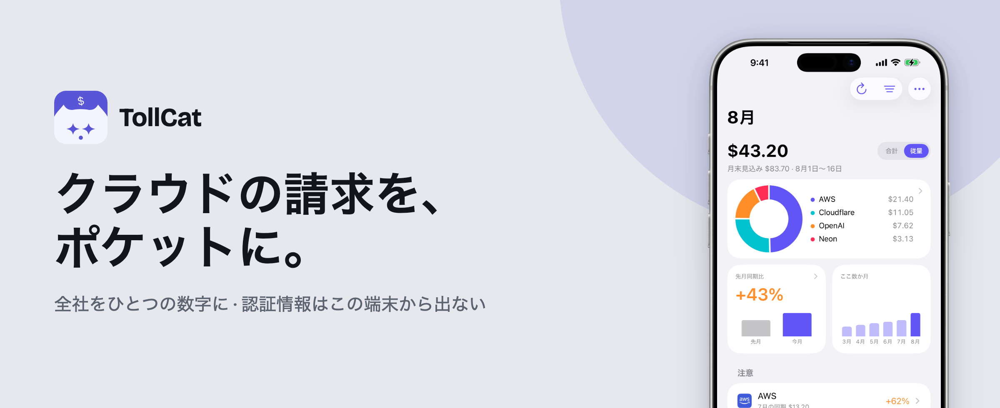
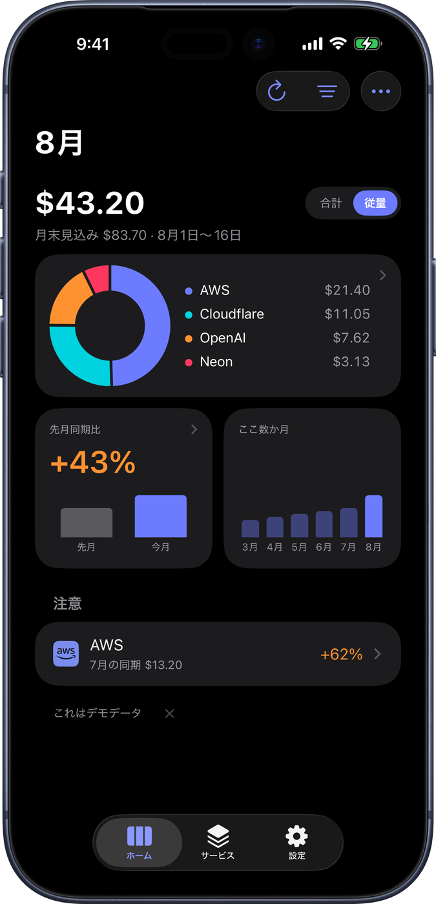
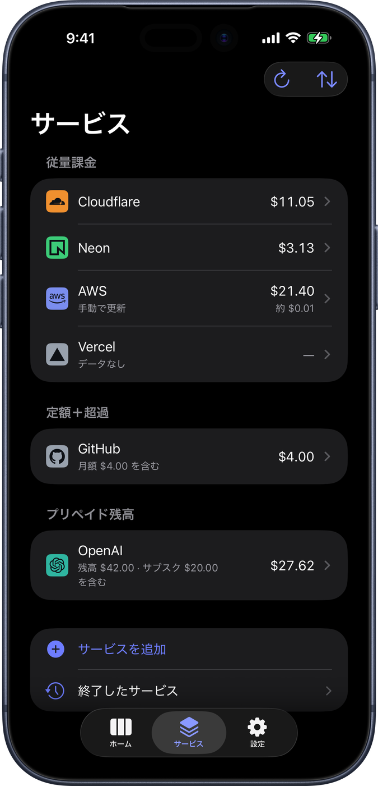
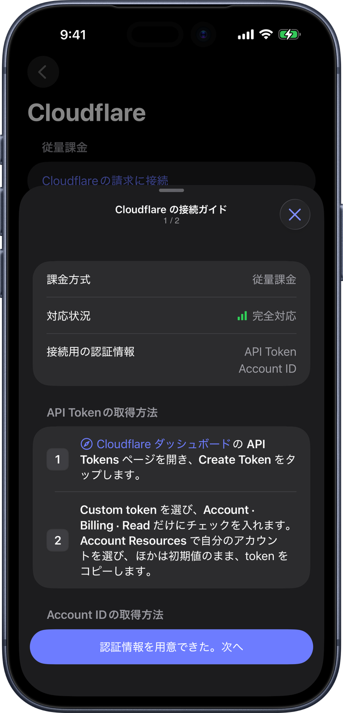
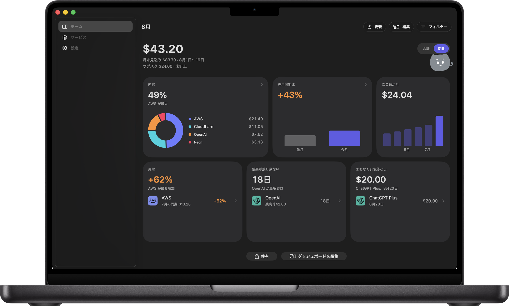
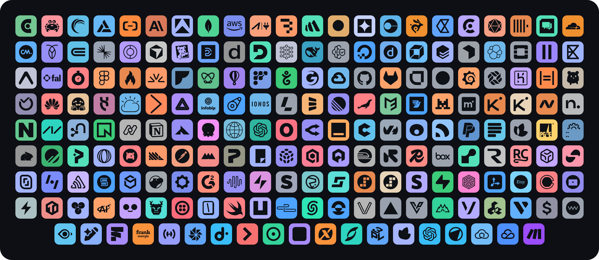

  

# TollCat

[English](README.md) · [中文](README.zh.md) · 日本語

TollCat は、自分で払っているクラウドと AI サービスの請求アプリです。各社で今月使った金額を足し合わせて、ひとつの合計にします。その下に各社の内訳が並びます。認証情報はこの端末の Keychain にだけ保存され、iCloud にもバックアップにも入りません。請求の取得は端末から各社の公式 API へ直接行い、間にサーバーはありません。合計は、ふと目をやる場所にも置けます。iPhone のウィジェットや、Mac のメニューバーです。

SwiftUI、iOS 26+ / macOS 26+、iPhone、iPad、Mac。無料、任意のチップ、MIT ライセンスです。

<table>
  <tr>
    <td width="33%"></td>
    <td width="33%"></td>
    <td width="33%"></td>
  </tr>
  <tr>
    <td align="center">ひとつの合計と、その下に各社の内訳</td>
    <td align="center">追加した各社を、課金方式ごとに</td>
    <td align="center">サービスごとのセットアップガイド：読み取り専用、手順つき</td>
  </tr>
</table>

  
   同じアプリが Mac にも。iPad にも。

**残りの画面は。** iPad、ウィジェット、メニューバーまで、すべてランディングページに並べてあります。自分に合うかを判断するにはそこが一番早いです：**[tollcat.app](https://tollcat.app/ja/)**。どのサービスの請求を読めるかは**[対応サービス](https://tollcat.app/ja/providers/)**にあります。

## 読める請求

  

220 社あまりのサービスは、請求を各社の API から直接読み取ります。そのうち 14 社は実際のアカウントで照合済みです。残りは公開ドキュメントに請求 API があり、動くはずのもので、どちらに当たるかはアプリ内で各社ごとに表示しています。ほかに 12 社は請求 API 自体がないため、自分のマシンで出した数字を読み取り受信箱へ送る形になります。全リストと各社に必要な認証情報は **[対応サービス](https://tollcat.app/ja/providers/)** にあります。

## 鍵はどこに置かれるか

- 認証情報はこの端末の Keychain にだけ書き込まれ、ほかのどこにもありません。iCloud にも、バックアップにも、TollCat のサーバーにも入りません。
- 更新のたびに、この端末から各社の公式 API へ直接つなぎます。間には何も挟まりません。
- ウィジェットはそもそもリクエストを送れません。そのターゲットは Providers モジュールをリンクしていません。
- このプロジェクト唯一のサーバー（チップ、フィードバック、セットアップカタログ）は認証情報に触れません。Providers と Tips は互いにリンクしません。
- App Store のビルドがこのソースかを確かめたいときは。Apple が再署名・暗号化するため、バイト単位で同じものは作れません。確かめられるのは、公開 CI がタグから署名付きの来歴とともに IPA をビルドすること、そして Mach-O の `LC_UUID` でそのビルドと手元のアプリを突き合わせることです。手順とコマンド、できないことは [VERIFY.md](VERIFY.md)（英語）にあります。

## リポジトリの中身

- `App/` + `Widget/` + `Mac/` — 薄い Xcode シェル。XcodeGen の spec は 2 つ（iOS は `project.yml`、Mac は `project-mac.yml`）。`.pbxproj` は手で編集しないでください。
- `Packages/MeterKit/` — Swift コードのすべて。依存方向の契約は [ARCHITECTURE.md](ARCHITECTURE.md) にあります。譲れない線は二つ：ウィジェットは Providers をリンクせず、自分ではリクエストを送れません。Providers と Tips は互いにリンクせず、請求の認証情報はチップ用 Worker に届きません。
- `Android/` — 開発中の Android 版。認証情報は同じように端末の Keystore にだけ置きます。まだ開発中です。お楽しみに！猫の手も借りたいので、待ちきれない方はぜひ。
- `Windows/` — WinUI 3 の外側に、DLL へクロスコンパイルした同じ Swift のコア。コードはありますが、Windows 11 で動かしたことはまだありません。
- `shared/` — クロスプラットフォームの事実源（JSON + ジェネレーター）。ここを編集して再生成します。`GENERATED` ヘッダー付きのファイルは出力物です。
- `site/` — [tollcat.app](https://tollcat.app) のランディングページ。静的サイトです。
- `worker/` — このプロジェクト唯一のサーバー。次のセクションへ。
- `ops/` — 手元の TUI（Ink + bun）。wrangler のログインでフィードバック、チップ、検針ポスト、利用数、未適用のマイグレーションを見ます。`bash scripts/ops`

## サーバー

`worker/` は api.tollcat.app で動き、扱うのは五つだけです：チップに添えるメッセージ、アプリ内フィードバック、公開セットアップカタログ、請求 API のないサービス向けの検針ポスト、匿名の画面カウント。どの経路もプロバイダーの認証情報には触れません。

自分の環境で動かすには：手順は [worker/README.md](worker/README.md) にあります。デプロイ前に `wrangler.toml` のルートを確認し、デプロイ後は `Packages/MeterKit/Sources/MeterTips/TipWorkerEndpoint.swift` の `origin` を自分の Worker に向けて、`OutboundHosts.swift` にそのホストを追加してください。

## ロードマップ

順番だけで、日付はありません：

1. **対応サービスを増やし、検証済みを増やす** — これに終わりはありません。フィードバックと、自分の実アカウントでの検証を頼りに、つなげるサービスを増やし、「理論上対応」から「検証済み」へ移していきます。
2. **Android（スマートフォン）** — リポジトリ内の Android 版をリリース品質に。タブレットは対象外です。
3. **Windows** — ソースはリポジトリにあります（WinUI 3 の外側に、同じ Swift のコア）。ただし Windows 11 で動かしたことはまだありません。まずは実際の請求を 1 件そこに表示するところからです。

## 約束

このプロジェクトはいま活発にメンテナンスしています。issue はきちんと読んで直しますし、上のロードマップも進めます。この一文がここにある限り、安心して使ってください。私たち自身が毎日これで請求を見ています。

PR も歓迎です。何を直したかが明確で、具体的なバグに対応する修正には、心から感謝します。機能の変更はより慎重に検討します — 迷ったら先に issue で相談してください — それでも同じように歓迎です。マージされてもされなくても、時間を割いてくれてありがとうございます。

## TollCat を支援する

TollCat を支援したいと思ったら、道は二つあります：

- [GitHub Sponsors](https://github.com/sponsors/KUD-00)
- アプリ内のチップ（設定 → チップ）— 猫におやつをあげられます

## 広告とスポンサーについて

チップだけでは、たぶんこのプロジェクトは続けられません。TollCat を使う人が、続ける価値があると言えるくらいまで増えたら、スポンサーを入れます。形は二つ、どちらもあなたがすでに払っているサービスに関わるものだけです。

- **スポンサーは同時に一社だけ。** ストアのスクリーンショットとランディングページの作例にその一社を優先して出し、設定 → このアプリについてにスポンサーの表記を一行置きます。
- **スポンサーからの知らせ。** そのサービスの詳細ページと、そのサービスを追加するときの画面に出ます。新しく入った機能、いま安くなっているプランなど。必ずそのサービス自身の話で、あなたの請求と関係のないものは出しません。

いまはまだアプリの中には何もありません。ある日の更新履歴で気づかれるより、先に書いておきます。

どんな形になっても、次の線は越えません。

- **広告ネットワークも第三者の SDK も使いません。** 目にするものは私たちが出したもので、広告サーバーから来たものではありません。
- **サービスの説明は売り物ではありません。** 何をするサービスか、どれが従量か、いつ締まるか。この説明は私たちの判断であって、スポンサーに書き換えさせることはありません。公式の紹介文は「XX 提供」と明記したうえで、私たちの説明と並べて載せられます。この枠は無償で、これからも売りません。
- **どれを出すかは、私たちではなく端末が選びます。** スポンサーの知らせは公開カタログに相乗りして丸ごと配られ、どれを見せるかは端末の中で決まります。どのサービスをつないでいるか、いくら使ったかは、私たちにもスポンサーにも分かりません。もともと端末から出ませんし、どの通信にも紛れ込ませません。
- **邪魔をしません。** 全画面広告もポップアップも通知もなく、ダッシュボードの合計金額の隣にも出しません。
- **スポンサーなら、スポンサーと書きます。** このアプリについてに置く表記にはその旨を明記します。作例でスポンサーを優先することは、ここで一度お知らせします。画像ごとに但し書きは付けません。

信じてもらう必要はありません。アプリは MIT で、ソースはここにあります。この線を越えたビルドが出れば diff に残りますし、それを指摘する issue はまったく正当です。

プライバシーを先に掲げているアプリで「広告」の二文字を読んで嬉しい人はいません。だからこそ、まだ一円も入っていないうちに、この線を決めておきます。

## ライセンス

コードは MIT です — [LICENSE](LICENSE) をどうぞ。使うのも、変えるのも、配るのも、売るのも自由です。

ただしブランドはこの許諾に含まれません。TollCat という名前、アプリアイコン、猫のアートワークは私たちのものです。改変版を配布するときは、名前とアイコンをご自身のものに変えて、私たちが署名して公開しているアプリと間違われないようにしてください。そのうえで、中身もご自身のアプリにしてください。名前だけ変えてほとんど手を入れていないものが App Store や Google Play に出てきたら、こちらから通報します。どちらのストアにも重複出品についてのルールがあり、名前を変えれば済む話ではありません。

各サービスのロゴも MIT には含まれません。[Simple Icons](https://simpleicons.org) のマークは CC0、それ以外は公式 SVG を 24×24 に収めただけです。名称と標章の権利は各社にあります。どの請求を読めるかを示すための使用であり、後援や提携を意味しません。出典は [THIRD-PARTY-NOTICES.md](THIRD-PARTY-NOTICES.md)。使い方がおかしいと思ったら issue を開いてください。
