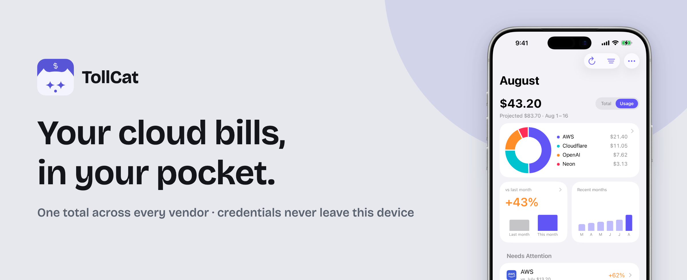
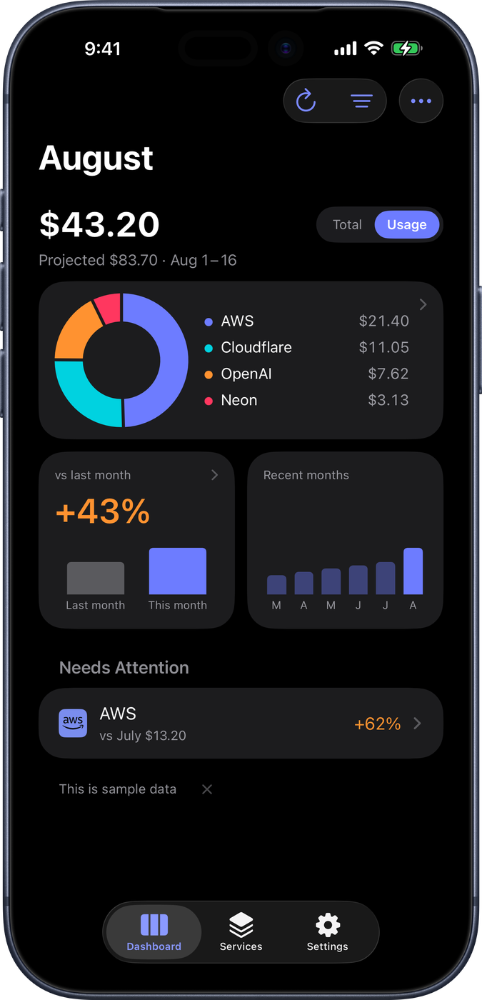
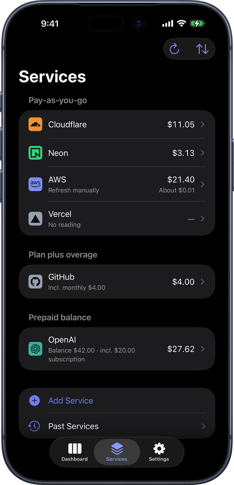
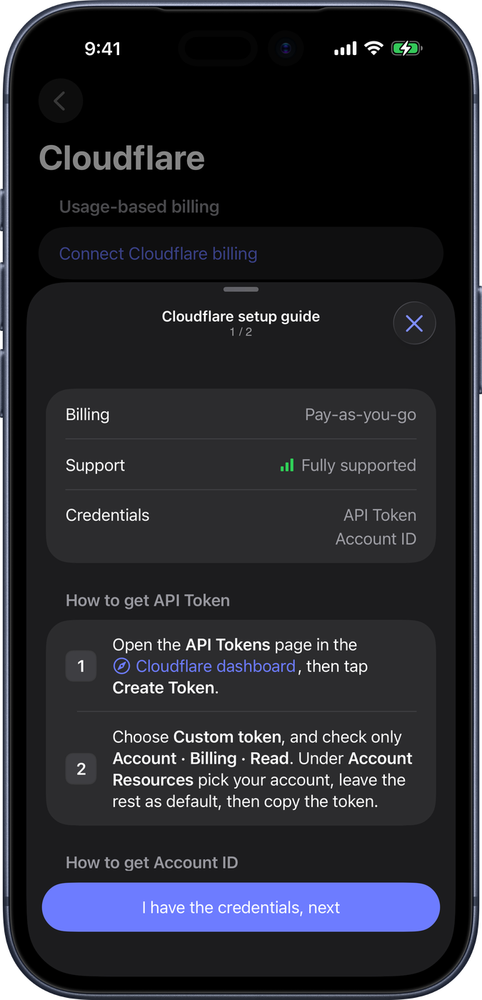
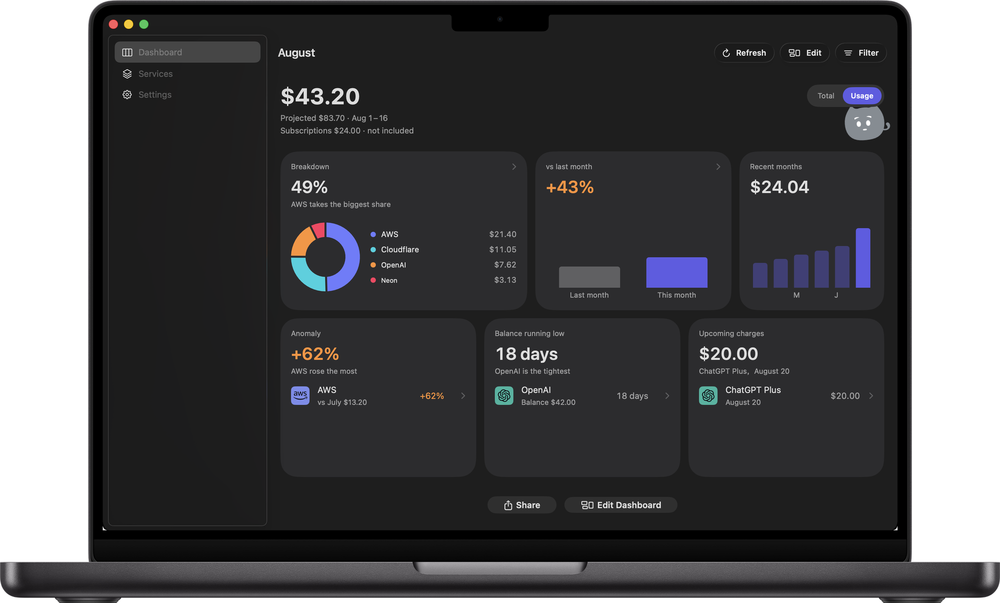

  

# TollCat

English · [中文](README.zh.md) · [日本語](README.ja.md)

TollCat is a billing app for the cloud and AI services you pay for. It adds up what you've spent this month across all of them and gives you one total, with the per-vendor breakdown underneath. Credentials stay in the on-device Keychain — never iCloud, never a backup — and the device talks directly to each vendor's official API, with no server in between. The total also goes wherever you'd glance at it: iPhone widgets, the Mac menu bar.

SwiftUI, iOS 26+ and macOS 26+, iPhone, iPad, and Mac. Free, with optional tips. MIT licensed.

<table>
  <tr>
    <td width="33%"></td>
    <td width="33%"></td>
    <td width="33%"></td>
  </tr>
  <tr>
    <td align="center">One total, with the breakdown underneath</td>
    <td align="center">Every service, grouped by how it bills</td>
    <td align="center">A setup guide per service: read-only, step by step</td>
  </tr>
</table>

  
   The same app on Mac. iPad too.

**Want to see the rest?** iPad, the widgets, the menu bar — every screen is on the landing page, and that's the fastest way to judge whether this is for you: **[tollcat.app](https://tollcat.app)**. Everything it can read a bill from is listed at **[Supported services](https://tollcat.app/providers/)**.

## Verify what you install

The App Store binary is re-signed and encrypted by Apple, so it can't be reproduced byte-for-byte from this source. What can be checked: public CI builds the IPA from a tag and attaches signed provenance, and the Mach-O `LC_UUID` ties that build to the app on your phone. Steps, commands, and the honest limits are in [VERIFY.md](VERIFY.md).

## What's in this repo

- `App/` + `Widget/` + `Mac/` — thin Xcode shells. Two XcodeGen specs generate them: `project.yml` (iOS) and `project-mac.yml` (Mac); don't edit `.pbxproj` by hand.
- `Packages/MeterKit/` — all the Swift code, split into modules. The dependency contract lives in [ARCHITECTURE.md](ARCHITECTURE.md). Two hard lines: the widget doesn't link Providers, so it can't make requests of its own; Providers and Tips never link each other, so billing credentials can't reach the tip worker.
- `Android/` — an Android version in development. Credentials live in the on-device Keystore the same way. Not done yet — stay tuned, or come lend a paw.
- `Windows/` — a WinUI 3 shell over the same Swift core, cross-compiled to a DLL. Written, never yet run on Windows 11.
- `shared/` — cross-platform sources of truth (JSON + generators). Edit here and regenerate; files with a `GENERATED` header are outputs.
- `site/` — the [tollcat.app](https://tollcat.app) landing page, a static site.
- `worker/` — the project's only server, see below.
- `ops/` — a local TUI (Ink + bun). Uses your wrangler login to inspect feedback, tips, the inbox, usage, and unapplied migrations. `bash scripts/ops`

## The server

`worker/` runs at api.tollcat.app and handles five things: tip notes, in-app feedback, the public setup catalog, the reading inbox for services without a billing API, and anonymous page counts. None of these paths ever touch a provider credential.

To run your own: steps are in [worker/README.md](worker/README.md). Check the routes in `wrangler.toml` before deploying, then point `origin` in `Packages/MeterKit/Sources/MeterTips/TipWorkerEndpoint.swift` at your worker and add the host to `OutboundHosts.swift`.

## Roadmap

Rough order, no dates:

1. **More services, more of them verified** — this one never closes: grow the supported list and move entries from "should work" to "tested against a real account", driven by feedback and by trying things ourselves.
2. **Android (phones)** — bring the in-repo Android version up to shipping quality. Tablets are out of scope.
3. **Windows** — the source is in the repo (WinUI 3 shell over the same Swift core), but it has never been run on Windows 11. Getting one real bill on screen there is the next step.

## Commitment

This project is under active maintenance: we read and fix issues, and the roadmap above keeps moving. As long as this paragraph is here, you can count on that — we check our own bills with it every day.

PRs are welcome too. A clearly written fix that maps to a concrete bug earns our genuine gratitude. Feature changes we weigh more carefully — if in doubt, open an issue first — but they're just as welcome. Merged or not, thank you for spending the time.

## Support TollCat

If you'd like to support TollCat, there are two ways:

- [GitHub Sponsors](https://github.com/sponsors/KUD-00)
- A tip inside the app (Settings → Tip) — it treats the kitty

## Ads and sponsorship

Tips alone probably won't pay for this. If enough people end up using TollCat for it to be worth keeping alive, we'll take sponsorship. Two shapes, both tied to services you already pay for:

- **One sponsor at a time.** That one gets first place in the store screenshots and the landing page examples, and a sponsor credit under Settings → About.
- **Notes from the sponsor.** On that service's detail page, and when you're adding it. A new feature it shipped, a plan that's cheaper now. Always about that service — never something unrelated to the bills you're tracking.

None of it is in the app today. We'd rather write it down here than have it turn up in a release note one day.

Whatever it turns into, these are the lines:

- **No ad network, no third-party SDK.** Anything you see came from us, not from an ad server.
- **What we say about a service isn't for sale.** What it does, what's usage-based, when it settles — that description is our own read, and sponsorship doesn't rewrite it. A service is welcome to supply its own blurb, marked "provided by X", sitting alongside ours. That slot is free, and it stays free.
- **Your phone picks which note to show, not us.** Sponsor notes ride along with the public catalog, which downloads whole; your phone chooses the relevant one locally. Which services you connect and what you spend stay unknown to us and to the sponsor — that never leaves your device, and it isn't slipped into a request either.
- **Nothing interrupts you.** No full-screen ads, no popups, no notifications, and nothing beside the number on your dashboard.
- **Sponsored says sponsored.** The About credit is labelled. Sponsors going first in example screenshots is declared right here, once, rather than tagged under every image.

You don't have to take our word for any of that. The app is MIT and the source is right here: a build that crosses one of those lines shows up in the diff, and an issue pointing at it is entirely fair.

Nobody enjoys reading the word "ads" in an app that leads with privacy. That's exactly why the limits go in writing now, while there's still no money on the table.

## License

The code is MIT — see [LICENSE](LICENSE). Use it, change it, ship it, sell it.

The brand isn't part of that grant: the TollCat name, the app icon, and the cat artwork stay ours. If you distribute a modified build, give it its own name and icon, so nobody mistakes it for the app we sign and publish — and make it actually your own app. If this one turns up on the App Store or Google Play under a different name with little else changed, we’ll report it. Both stores have rules against duplicate listings, and a new name doesn’t clear them.

Vendor logos in the app aren't ours either, and they aren't MIT. Marks from [Simple Icons](https://simpleicons.org) are CC0; the rest are official SVGs we only scaled to fit a 24×24 tile. The names and marks belong to their owners — we use them to say which bills we can read, not as an endorsement. Sources are in [THIRD-PARTY-NOTICES.md](THIRD-PARTY-NOTICES.md); if that use looks wrong, open an issue.
