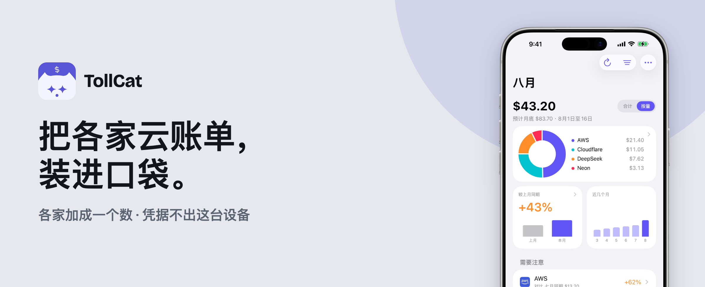
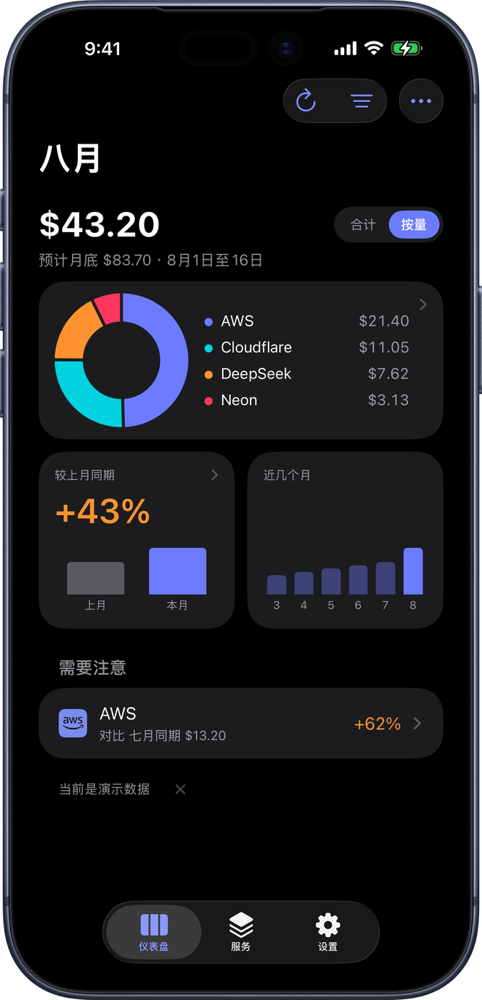
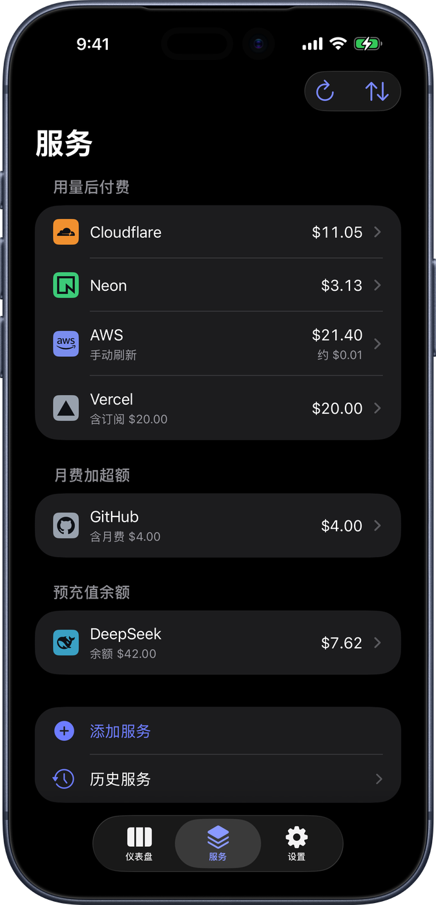
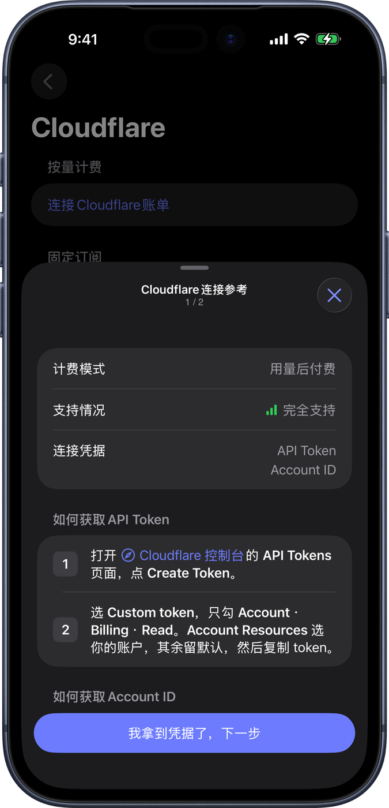
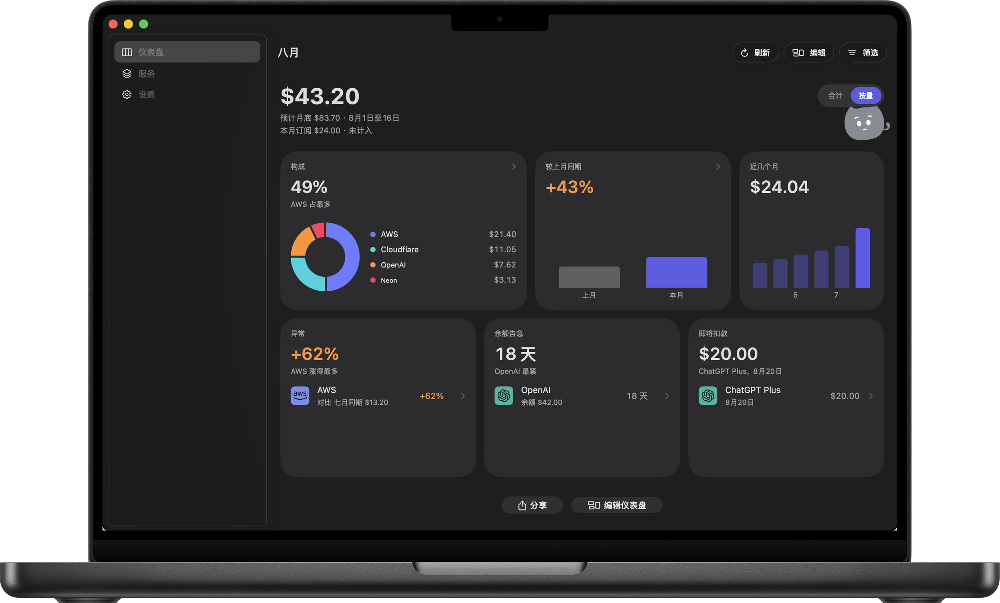

  

# TollCat

[English](README.md) · 中文 · [日本語](README.ja.md)

TollCat 是账单 App，管你自己在付的那些云和 AI 服务。它把你这个月在各家花的钱加在一起，给你一个总数，底下是各家的明细。凭据只存本机 Keychain，不进 iCloud，也不随备份走；取账单由这台设备直连各家官方 API，中间没有任何服务器经手。这个总数也可以放到你顺手一瞥的地方：iPhone 的小组件，Mac 的菜单栏。

SwiftUI，iOS 26+ / macOS 26+，iPhone、iPad 和 Mac。免费，可选打赏，MIT 许可。

<table>
  <tr>
    <td width="33%"></td>
    <td width="33%"></td>
    <td width="33%"></td>
  </tr>
  <tr>
    <td align="center">一个总数，底下是各家明细</td>
    <td align="center">加进来的每一家，按计费方式分组</td>
    <td align="center">每家一份接入向导：只读权限，一步一步来</td>
  </tr>
</table>

  
   同一个 App，在 Mac 上。iPad 也有。

**想看剩下的？** iPad、小组件、菜单栏，每一屏都摆在落地页上——要判断这个 App 是不是你要的，看那里最快：**[tollcat.app](https://tollcat.app)**。能读到哪些家的账单，列在**[能接哪些服务](https://tollcat.app/providers/)**。

## 如何验证

App Store 上的包会被 Apple 重新签名并加密，做不到和这份源码编出逐字节相同的副本。能核对的是：公开 CI 从 tag 编出 IPA 并附上签名的溯源证明，再用 Mach-O 的 `LC_UUID` 把那次构建和你手机上的 App 对上。步骤、命令、以及做不到的事，都在 [VERIFY.md](VERIFY.zh.md)。

## 仓库里有什么

- `App/` + `Widget/` + `Mac/` —— 薄 Xcode 壳。两份 XcodeGen spec 生成它们：`project.yml`（iOS）和 `project-mac.yml`（Mac），不要手改 `.pbxproj`。
- `Packages/MeterKit/` —— 全部 Swift 代码，按模块分层。依赖方向的合约在 [ARCHITECTURE.md](ARCHITECTURE.zh.md)，其中两条底线：Widget 不链接 Providers，自己发不了任何请求；Providers 和 Tips 互不链接，账单凭据走不到打赏 Worker。
- `Android/` —— 开发中的 Android 版，凭据同样只存本机（Android Keystore）。还没做完，敬请期待！等不及的话，欢迎搭把爪。
- `Windows/` —— WinUI 3 的皮，底下是交叉编译成 DLL 的同一份 Swift 核心。代码写完了，还没在 Windows 11 上跑起来过。
- `shared/` —— 跨端的事实源（JSON + 生成器）。改这里再跑生成器，带 `GENERATED` 头的文件不要手改。
- `site/` —— [tollcat.app](https://tollcat.app) 落地页，静态站。
- `worker/` —— 这个项目唯一的服务端，见下一节。
- `ops/` —— 本机 TUI（Ink + bun）。用 wrangler 权限看反馈、打赏、信箱、用量、未打上的迁移。`bash scripts/ops`

## 服务端

`worker/` 跑在 api.tollcat.app，处理五件事：打赏留言、应用内反馈、公开的接入说明目录、给没有账单接口的服务准备的读数信箱，以及匿名的页面计数。这几条路都碰不到 provider 凭据。

想部署自己的一份：步骤在 [worker/README.md](worker/README.md)，部署前过一眼 `wrangler.toml` 里的路由；部署后把 Worker URL 填进 `Packages/MeterKit/Sources/MeterTips/TipWorkerEndpoint.swift` 的 `origin`，并在 `OutboundHosts.swift` 里同步那个 host。

## 路线图

只有顺序，没有日期：

1. **更多服务、更多测试过的**——这条不会关掉：跟着反馈、也自己拿真实账号去试，让能接的服务更多更稳，把更多家从「理论支持」挪进「测试过」。
2. **Android（手机）**——把仓库里的 Android 版做到能上架的程度。平板不在计划里。
3. **Windows**——源码已经在仓库里（WinUI 3 的皮，底下还是同一份 Swift 核心），但还没在 Windows 11 上跑起来过。下一步是先让一家真实账单在那边显示出来。

## 承诺

这个项目目前在积极维护：issue 我们会认真读、认真修，上面路线图里的东西也会继续做。只要这段话还写在这里，就可以放心用——我们自己每天都用它看账单。

也欢迎 PR。写得清楚、能对上一个具体 bug 的修复，我们真心感谢。功能类的改动会考虑得更慎重——拿不准的话，先开个 issue 聊聊——但同样欢迎。无论最后合不合，谢谢你愿意花这份时间。

## 支持 TollCat

如果你想支持我们，有两条路：

- [GitHub Sponsors](https://github.com/sponsors/KUD-00)
- App 内打赏（设置 → 打赏）——请猫猫吃点东西

## 广告与赞助

光靠打赏，大概率养不活这个项目。如果用 TollCat 的人多到值得一直做下去，我们会引入赞助。想做成两种，都跟你已经在付钱的那些服务有关：

- **唯一赞助位。** 同一时间只有一家。商店截图、落地页示例图里优先出现这家，设置 → 关于里留一行赞助 credit。
- **赞助商的相关消息。** 出现在这家的服务详情页，以及你添加这家服务的时候。比如上了什么新功能、哪个套餐现在更划算。只会是这家服务自己的事，不会是跟你的账单无关的东西。

这些现在都还不在 App 里。与其哪天在更新说明里让你撞见，不如现在就写下来。

不管最后做成什么样，这几条不会越：

- **不接广告联盟，不塞第三方 SDK。** 你看到的赞助内容由我们自己发出，不来自任何广告服务器。
- **一家服务怎么介绍，钱买不动。** 它是做什么的、哪些按量、什么时候结算——这段说明是我们自己的判断，不接受赞助改写。服务方欢迎自己提供一段官方简介，标明「由 XX 提供」，跟我们那段并排放；这个位置不收钱，以后也不收。
- **该给你看哪条，是你手机自己挑的。** 赞助消息跟着那份公开目录整份下发，你的手机在本地选出该显示的那条。你接了哪几家、花了多少，我们和赞助商都不知道——这些本来就不出你的设备，也不会被夹进任何一次请求里带出去。
- **不打断你。** 没有全屏广告、没有弹窗、没有推送，仪表盘上那个总数旁边也不会有。
- **是赞助就写明是赞助。** 关于页那行 credit 写明「赞助」；示例截图里优先出现赞助商这件事，由这一段声明，不在每张图下面再挂一遍。

这些话你不用信：App 是 MIT 的，源码就在这里。哪个版本越了上面任何一条，diff 里一定看得见，来开个 issue 指出来完全合理。

在一个把隐私放在最前面的 App 里读到「广告」两个字，谁都不会高兴。所以这些边界要趁还没有一分钱进来的时候先定死。

## 许可

代码是 MIT 的——见 [LICENSE](LICENSE)。拿去用、改、发布、卖，都可以。

品牌不在这份授权里：「TollCat」这个名字、应用图标和猫的形象仍然归我们。分发修改版时，请换上你自己的名字和图标，别让人误以为装的是我们签名发布的那一个——也请真的把它做成你自己的 App。要是 App Store 或 Google Play 上出现一个只换了名字、别的几乎没动的版本，我们会去举报。两家商店都有针对重复上架的规则，换个名字绕不开。

各家服务的 logo 也不在 MIT 里。[Simple Icons](https://simpleicons.org) 的是 CC0；其余是官网 SVG，我们只缩放到 24×24 的格子。名字和标志仍归各家——拿来标明能读谁的账单，不是代言。来源写在 [THIRD-PARTY-NOTICES.md](THIRD-PARTY-NOTICES.md)；觉得用得不对，提 issue。
